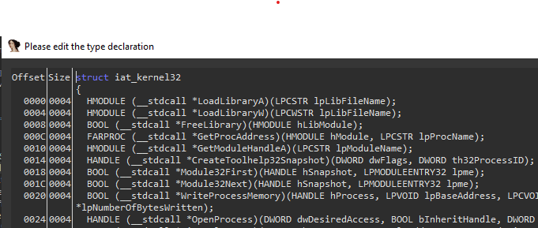

## Summary

Mostly tools created to work on **QAKBOT** to help analysis.

## Sample

The sample comes [Triage](https://tria.ge/220331-ty711aaggp)

|          |                587b2426964f6c64297ceae0715c2a16                |
|----------|----------------------------------------------------------------|
|file size |877568 (857.0KiB)                                               |
|file magic|PE32 executable (DLL) (GUI) Intel 80386, for MS Windows         |
|md5       |587b2426964f6c64297ceae0715c2a16                                |
|sha1      |1e0f04b4c3dd5acea0ec5a2cea3b5fee980ec7b9                        |
|sha256    |708c5b9fcf965d331be872286f53cd12b0f53d80e2e2336309e6ca6cfb2ae0d3|
|imphash   |b7eb624a3eae51220b69ba9ecf89dea7                                |
|PE date   |2022-03-31 12:05:18 GMT                                         |

I unpack it manually

|          |          587b2426964f6c64297ceae0715c2a16.unpack3.bin          |
|----------|----------------------------------------------------------------|
|file size |417792 (408.0KiB)                                               |
|file magic|PE32 executable (DLL) (GUI) Intel 80386, for MS Windows         |
|md5       |ef42063f6c2052752bebce1819acc641                                |
|sha1      |407e06aa4917e0415ccdf790a15a65d37a62b0ef                        |
|sha256    |9005d35019e8ffb488545e66f55a5b3fc2fda61632f7fc2e46fd525c8a0fd4df|
|imphash   |898ae83d196651683fa2c0e49adbf703                                |
|PE date   |2022-02-24 13:16:33 GMT                                         |

Both versions are in the [samples folder](samples/) in a ZIP protected files with the password `infected`

## Tools

### qbot4_tools.py

[qbot4_tools.py](tools/qbot4_tools.py) is a standalone script and an IDA python script. In standalone mode, it has two functions

* `strings`, decrypt the two strings buffer used in the sample
* `iat`, reconstruct the IAT struct from the sample
* `config`, dump the configuration from the PE file resources

If loaded inside IDA it will decrypt all the strings and set the decrypted value in comment.

#### IDA

To work inside IDA [qbot4_tools.py](tools/qbot4_tools.py) need to have two functions define inside the IDB

* `GetEncStrByIdx` at `0xee6bd` 
* `GetEncStrByIdxW` at `0xee612`

Both functions are the same except the second one return a `WCHAR*` buffer.


#### Strings

To work it needs the correct FO (File Offset) found in the unpacked sample

```python
strs_offsets = {
    'StrBuf1': {
        'data': [0x60aa0, 0x442],
        'key': [0x60a40, 0x5a]
    },
    'StrBuf2': {
        'data': [0x60ee8, 0xfd2],
        'key': [0x61ec0, 0x5a]
    },
}
```

To find them we need to identify the decryption function in the sample it's at `0xee6bd`

It has the following prototype `int GetStrByIdx(BYTE *pBuffer, DWORD dwBufferLen, BYTE *pKey, DWORD dwIdx)`

This function has two xref each one of them using a different `pBuffer`/`pKey` that where we can find the value used for `StrBuf1` and `StrBuf2`. We use the FO (File Offset) and not the VA (Virtual Address)


```console
$ python3 qbot4_tools.py strings ../samples/587b2426964f6c64297ceae0715c2a16.unpack3.bin | head
StrBuf1,0x60aa0,0x0 b'route print'
StrBuf1,0x60aa0,0xc b'qwinsta'
StrBuf1,0x60aa0,0x14 b'ipconfig /all'
StrBuf1,0x60aa0,0x22 b'\\System32\\WindowsPowerShel1\\v1.0\\powershel1.exe'
StrBuf1,0x60aa0,0x52 b'jHxastDcds)oMc=jvh7wdUhxcsdt2'
StrBuf1,0x60aa0,0x70 b'26F517AB'
StrBuf1,0x60aa0,0x79 b'ProfileImagePath'
StrBuf1,0x60aa0,0x8a b'schtasks.exe /Delete /F /TN %u'
StrBuf1,0x60aa0,0xa9 b'net localgroup'
StrBuf1,0x60aa0,0xb8 b'Self test OK.'
```

#### IAT

They don't use the classic IAT to access DLL functions. For each DLL it has an array of CRC values that match the function name needed.

Once the sample starts it find all the function address where the CRC value matches the name and returns an array of it.

The function in charge of that is at `0xE8087`


So for each DLL we will have to create a structure like this



After we can set the structure type to the pointer


To recover the structure we had to set manually the FO (File Offset) and the number of elements in the array. We hardcode the `crc_table`.

```python
crc_table =    [ 0x00000000, 0x1db71064, 0x3b6e20c8, 0x26d930ac,
    0x76dc4190, 0x6b6b51f4, 0x4db26158, 0x5005713c,
    0xedb88320, 0xf00f9344, 0xd6d6a3e8, 0xcb61b38c,
    0x9b64c2b0, 0x86d3d2d4, 0xa00ae278, 0xbdbdf21c]

import_offsets = {
    'kernel32.dll': [0x5b398, 312],
    'ntdll.dll': [0x5b530, 40],
    'user32.dll': [0x5b4d8, 84],
    'netapi32.dll': [0x5b630, 24],
    'advapi32.dll': [0x5b560, 204],
    'shlwapi.dll': [0x5b658, 44],
    'shell32.dll': [0x5b64c, 8],
    'userenv.dll': [0x5b69c, 4],
    'ws2_32.dll': [0x5b688, 16],
}
```

The CRC function looks like this


The python script will generate all the CRC for all the functions name in [function_names.txt](tools/function_names.txt). For each DLL it will iterate over the CRC array and try to find a match in the lookup table we build. Then we try to find the function definition on MS website [msdn_prototype.py](tools/msdn_prototype.py) before we build the structure and print it.

The result product a header file that IDA can ingest [bot4_iat.h](idb/qbot4_iat.h).

```console
$ python3 qbot4_tools.py iat ../samples/587b2426964f6c64297ceae0715c2a16.unpack3.bin  | tee qbot4_iat.h
...
INFO:root:netapi32.dll::NetWkstaTransportAdd, 0xf2ff4858
INFO:root:netapi32.dll::NetWkstaTransportDel, 0xe3f433c0
INFO:root:netapi32.dll::NetWkstaTransportEnum, 0x88780bb9
INFO:root:netapi32.dll::NetWkstaUserEnum, 0x2b54dc90
INFO:root:netapi32.dll::NetWkstaUserGetInfo, 0xb38f26f9
INFO:root:netapi32.dll::NetWkstaUserSetInfo, 0x201e9e24
INFO:root:netapi32.dll::NetapipBufferAllocate, 0x16275ecf
INFO:root:netapi32.dll::Netbios, 0x01fc782e
INFO:root:netapi32.dll::NetpAddTlnFtinfoEntry, 0x4642500c
INFO:root:netapi32.dll::NetpAllocFtinfoEntry, 0x6f6ad5e6
INFO:root:netapi32.dll::NetpAssertFailed, 0xe27d49c7
INFO:root:netapi32.dll::NetpCleanFtinfoContext, 0x9e713eef
...
INFO:root:NtosKrnl.exe  LOGICAL RtlFreeHeap( PVOID HeapHandle, ULONG Flags,  PVOID BaseAddress );
INFO:root:NtosKrnl.exe  NTSTATUS RtlGetVersion( PRTL_OSVERSIONINFOW lpVersionInformation );
INFO:root:NtosKrnl.exe   NTSTATUS NtCreateSection( PHANDLE SectionHandle, ACCESS_MASK DesiredAccess, POBJECT_ATTRIBUTES ObjectAttributes, PLARGE_INTEGER MaximumSize, ULONG SectionPageProtection, ULONG AllocationAttributes, HANDLE FileHandle );
INFO:root:Ntdll.dll  NTSTATUS NtClose( HANDLE Handle );
INFO:root:NtosKrnl.exe NTSTATUS ZwQueryInformationThread (  HANDLE ThreadHandle,  THREADINFOCLASS ThreadInformationClass,  PVOID ThreadInformation,  ULONG ThreadInformationLength,  PULONG ReturnLength );
...
struct iat_kernel32 {
        HMODULE (__stdcall *LoadLibraryA)( LPCSTR lpLibFileName );
        HMODULE (__stdcall *LoadLibraryW)( LPCWSTR lpLibFileName );
        BOOL (__stdcall *FreeLibrary)( HMODULE hLibModule );
        FARPROC (__stdcall *GetProcAddress)( HMODULE hModule, LPCSTR lpProcName );
        HMODULE (__stdcall *GetModuleHandleA)( LPCSTR lpModuleName );
        HANDLE (__stdcall *CreateToolhelp32Snapshot)( DWORD dwFlags, DWORD th32ProcessID );
        BOOL (__stdcall *Module32First)( HANDLE hSnapshot, LPMODULEENTRY32 lpme );
        BOOL (__stdcall *Module32Next)( HANDLE hSnapshot, LPMODULEENTRY32 lpme );
        BOOL (__stdcall *WriteProcessMemory)( HANDLE hProcess, LPVOID lpBaseAddress, LPCVOID lpBuffer, SIZE_T nSize, SIZE_T *lpNumberOfBytesWritten );
        HANDLE (__stdcall *OpenProcess)( DWORD dwDesiredAccess, BOOL bInheritHandle, DWORD dwProcessId );
        BOOL (__stdcall *VirtualFreeEx)( HANDLE hProcess, LPVOID lpAddress, SIZE_T dwSize, DWORD dwFreeType );
        DWORD (__stdcall *WaitForSingleObject)( HANDLE hHandle, DWORD dwMilliseconds );
        BOOL (__stdcall *CloseHandle)( HANDLE hObject );
...
struct iat_ws2_32 {
        int (__stdcall *WSAGetLastError)();
        void (__stdcall *WSASetLastError)( int iError );
        char * (__stdcall *inet_ntoa)( in_addr in );
        unsigned long (__stdcall *inet_addr)( const char *cp );
};
```

#### config

The initial configuration is saved in the PE file resources inside two entries in `RT_RCDATA` directory. 

The shortest one contains the *Botnet* and *CampaignId*. The second one is a list of `C2`

```console
$ python3 qbot4_tools.py config -f ../samples/587b2426964f6c64297ceae0715c2a16.unpack3.dll
INFO:root:res 18270D2E at 0x680ac len 0x2e
INFO:root:res 26F517AB at 0x680dc len 0x42e
10=biden56
3=1648712144
176.67.56.94:443
148.64.96.100:443
47.180.172.159:443
47.23.89.62:995
...
```

Decryption is *RC4*, to verify the data once decrypted the 20bytes are compare against the *SHA1* of the data. The key is a SHA1 of the first 20 bytes of data or the string `\System32\WindowsPowerShel1\v1.0\powershel1.exe`.

### msdn_prototype.py

[msdn_prototype.py](tools/msdn_prototype.py) is small script that tries to lookup a function name in https://docs.microsoft.com and returns the prototype, library name etc...

```console
python3 msdn_prototype.py CreateThread
{'name': 'CreateThread', 'prototype': 'HANDLE CreateThread( LPSECURITY_ATTRIBUTES lpThreadAttributes, SIZE_T dwStackSize, LPTHREAD_START_ROUTINE lpStartAddress,  LPVOID lpParameter, DWORD dwCreationFlags, LPDWORD lpThreadId );', 'typedef': 'HANDLE (__stdcall *CreateThread)( LPSECURITY_ATTRIBUTES lpThreadAttributes, SIZE_T dwStackSize, LPTHREAD_START_ROUTINE lpStartAddress,  LPVOID lpParameter, DWORD dwCreationFlags, LPDWORD lpThreadId );', 'minimum_supported_client': 'Windows\xa0XP [desktop apps | UWP apps]', 'minimum_supported_server': 'Windows Server\xa02003 [desktop apps | UWP apps]', 'target_platform': 'Windows', 'header': 'processthreadsapi.h (include Windows Server\xa02003, Windows\xa0Vista, Windows\xa07, Windows Server\xa02008  Windows Server\xa02008\xa0R2, Windows.h)', 'library': 'Kernel32.lib; WindowsPhoneCore.lib on Windows Phone 8.1', 'dll': 'Kernel32.dll; KernelBase.dll on Windows Phone 8.1'}
```

During the building of the script, I found  [https://github.com/MicrosoftDocs/sdk-api](https://github.com/MicrosoftDocs/sdk-api) but the prototype was not easily accessible

It uses `requests_cache`  so it caches results inside db, is possible to just use `requests`.

```console
 $ python3 msdn_prototype.py CreateThread CreateProcessW | jq
{
  "name": "CreateThread",
  "prototype": "HANDLE CreateThread( LPSECURITY_ATTRIBUTES lpThreadAttributes, SIZE_T dwStackSize, LPTHREAD_START_ROUTINE lpStartAddress,  LPVOID lpParameter, DWORD dwCreationFlags, LPDWORD lpThreadId );",
  "typedef": "HANDLE (__stdcall *CreateThread)( LPSECURITY_ATTRIBUTES lpThreadAttributes, SIZE_T dwStackSize, LPTHREAD_START_ROUTINE lpStartAddress,  LPVOID lpParameter, DWORD dwCreationFlags, LPDWORD lpThreadId );",
  "minimum_supported_client": "Windows XP [desktop apps | UWP apps]",
  "minimum_supported_server": "Windows Server 2003 [desktop apps | UWP apps]",
  "target_platform": "Windows",
  "header": "processthreadsapi.h (include Windows Server 2003, Windows Vista, Windows 7, Windows Server 2008  Windows Server 2008 R2, Windows.h)",
  "library": "Kernel32.lib; WindowsPhoneCore.lib on Windows Phone 8.1",
  "dll": "Kernel32.dll; KernelBase.dll on Windows Phone 8.1"
}
{
  "name": "CreateProcessW",
  "prototype": "BOOL CreateProcessW( LPCWSTR lpApplicationName, LPWSTR lpCommandLine, LPSECURITY_ATTRIBUTES lpProcessAttributes, LPSECURITY_ATTRIBUTES lpThreadAttributes, BOOL bInheritHandles, DWORD dwCreationFlags, LPVOID lpEnvironment, LPCWSTR lpCurrentDirectory, LPSTARTUPINFOW lpStartupInfo, LPPROCESS_INFORMATION lpProcessInformation );",
  "typedef": "BOOL (__stdcall *CreateProcessW)( LPCWSTR lpApplicationName, LPWSTR lpCommandLine, LPSECURITY_ATTRIBUTES lpProcessAttributes, LPSECURITY_ATTRIBUTES lpThreadAttributes, BOOL bInheritHandles, DWORD dwCreationFlags, LPVOID lpEnvironment, LPCWSTR lpCurrentDirectory, LPSTARTUPINFOW lpStartupInfo, LPPROCESS_INFORMATION lpProcessInformation );",
  "minimum_supported_client": "Windows XP [desktop apps | UWP apps]",
  "minimum_supported_server": "Windows Server 2003 [desktop apps | UWP apps]",
  "target_platform": "Windows",
  "header": "processthreadsapi.h (include Windows Server 2003, Windows Vista, Windows 7, Windows Server 2008  Windows Server 2008 R2, Windows.h)",
  "library": "Kernel32.lib",
  "dll": "Kernel32.dll"
}
```